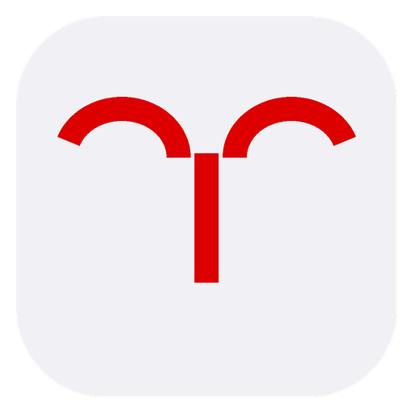

<p align="center">
  
</p>

# RamDoc

[](https://github.com/vGsteiger/RamDoc/actions/workflows/rust-ci.yml)
[](https://github.com/vGsteiger/RamDoc/actions/workflows/frontend-ci.yml)
[](https://github.com/vGsteiger/RamDoc/actions/workflows/security.yml)
[](https://github.com/vGsteiger/RamDoc/actions/workflows/lint.yml)
[](https://github.com/vGsteiger/RamDoc/actions/workflows/tauri-build.yml)
[](LICENSE)

**RamDoc** is a 100% local, encrypted macOS application for Swiss patient record management.
This repository (**RamDoc**) hosts the full open-source code.

## Releases / Download

Pre-built **macOS DMGs for Apple Silicon (aarch64)** are published automatically on every
versioned merge to `main`. Download the latest release from the
[GitHub Releases](https://github.com/vGsteiger/RamDoc/releases) page.

> **Note:** Intel Mac (x86_64) is not supported. The app requires Apple Silicon (M1 or later).

Releases are triggered when a PR is labeled `major`, `minor`, or `patch` (or uses conventional
commit prefixes such as `feat:` / `fix:`).

## Features

- **End-to-End Encryption** — AES-256-GCM for files; SQLCipher for the database
- **Swiss Healthcare Standards** — AHV number validation (EAN-13 checksum) and AMDP psychopathology structured forms
- **100% Local** — all data stays on your machine; no cloud dependencies
- **Full-Text Search** — encrypted FTS5 search with proper operator escaping
- **Local LLM Integration** — on-device report generation via llama.cpp with Metal GPU acceleration
- **Clinical Workflows** — sessions, diagnoses (ICD-10), medications, file attachments, reports
- **Audit Logging** — append-only compliance audit trail enforced by SQLite triggers
- **Security First** — macOS Keychain integration, zeroised key material, BIP-39 recovery

## Security

RamDoc is designed with a defence-in-depth approach:

| Concern | Implementation |
|---------|----------------|
| Data at rest | AES-256-GCM for all vault files; SQLCipher for the database |
| Key storage | macOS Keychain (`ch.dokassist.app`) — keys never touch disk unencrypted |
| Recovery | BIP-39 mnemonic phrase with brute-force protection (attempt counter + lockout) |
| Audit trail | Append-only `audit_log` SQLite table; deletion blocked by DB trigger |
| Input sanitisation | AHV validation, FTS5 query escaping, LLM prompt sanitisation (fence + fullwidth variants) |
| File safety | 500 MiB upload cap, symlink-escape prevention via `canonicalize()`, UUID temp filenames |
| Model integrity | SHA-256 verification on every GGUF model download; 60 GiB cap |
| Supply chain | GitHub Actions pinned to commit SHAs; `unsafe-inline` removed from CSP |

## Architecture

**Backend** — Rust (Tauri 2)

| Module | Responsibility |
|--------|----------------|
| `crypto.rs` | AES-256-GCM encrypt/decrypt for filesystem objects |
| `database.rs` | SQLCipher connection, migrations, FTS5 search |
| `keychain.rs` | macOS Keychain read/write via `security-framework` |
| `filesystem.rs` | Encrypted vault at `{data_dir}/vault/`; temp exports via UUID filenames |
| `recovery.rs` | BIP-39 mnemonic generation, verification, and brute-force-protected recovery |
| `state.rs` | Auth state machine: `FirstRun → Locked → Unlocked → RecoveryRequired` |
| `llm/` | GGUF model download (SHA-256 verified), llama.cpp engine, prompt sanitisation, streaming |
| `commands/` | Tauri IPC command handlers (auth, patients, sessions, diagnoses, medications, files, reports, search) |

**Frontend** — Svelte 5 + SvelteKit 2 + Tailwind CSS 4

| Module | Responsibility |
|--------|----------------|
| `lib/stores/auth.ts` | Reactive auth state (`authStatus`, `isLoading`) |
| `lib/api.ts` | Typed wrappers around every Tauri `invoke` call |
| `lib/amdp.ts` | AMDP psychopathology category definitions and serialize/deserialize helpers |
| `lib/components/` | AhvInput, PatientForm, ReportStream, AMDP forms, file management, clinical workflow UI |

**Database** — SQLCipher with two migrations:
- `001_initial_schema.sql` — patients, sessions, diagnoses, medications, files, reports, FTS5
- `002_audit_append_only.sql` — audit_log table + deletion-blocking trigger

## Development

### Prerequisites

- Rust 1.88+ (MSRV)
- Node.js 20+
- pnpm 8+
- macOS 13+ on Apple Silicon (Intel Macs are not supported)

### Build

```bash
# Install dependencies
cd dokassist
pnpm install

# Development mode
pnpm tauri dev

# Production build (single arch)
pnpm tauri build

# Production DMG (Apple Silicon)
pnpm tauri build --target aarch64-apple-darwin
```

### Testing

```bash
# Rust unit tests
cd dokassist/src-tauri
cargo test --lib

# Frontend unit + component tests (Vitest)
cd dokassist
pnpm test

# Frontend tests with coverage report
pnpm test:coverage
```

## CI/CD Pipeline

| Workflow | Trigger | Purpose |
|----------|---------|---------|
| `rust-ci.yml` | push / PR | Unit tests, cross-platform builds, Clippy |
| `frontend-ci.yml` | push / PR | Svelte build, type-check, Vitest tests |
| `security.yml` | daily + push | `cargo audit`, dependency vulnerability scan |
| `lint.yml` | push / PR | `rustfmt`, `cargo clippy`, frontend lint |
| `release.yml` | merge to `main` | Semantic versioning, Apple Silicon DMG build, GitHub Release |

See [CI/CD Documentation](.github/CI_CD_DOCUMENTATION.md) for details.

## Contributing

See [CONTRIBUTING.md](CONTRIBUTING.md) for the full contributor guide — dev setup, code style, branch naming, commit conventions, PR process, and testing requirements.

PR labels drive the release version bump:

| Label | Effect |
|-------|--------|
| `major` | Breaking change — bumps `X.0.0` |
| `minor` | New feature — bumps `0.X.0` |
| `patch` | Bug fix / chore — bumps `0.0.X` |
| `skip-release` | Merges without cutting a release |

Conventional commit prefixes (`feat:`, `fix:`, `feat!:`) are also recognised when no label is set.

## License

MIT License — see [LICENSE](LICENSE) for details.

